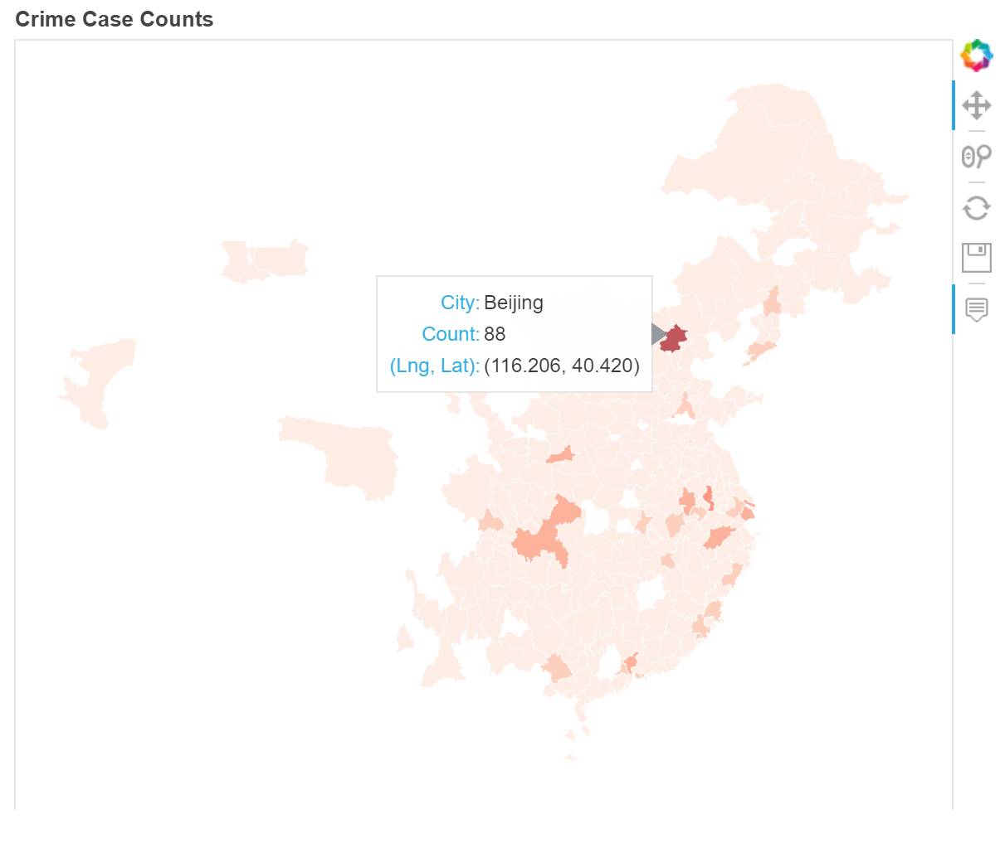
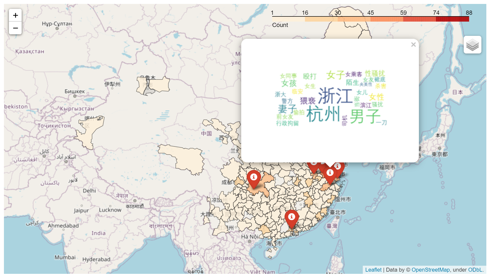

# Final Project-Rooibos
This is the final project of team rooibos. We tried to explore how the occurrence of gender-specific crimes in China relates to socioeconomic factors. We scraped gender-specific crime data from a 'bot' webpage documenting such incidents and matched most of them to their happening cities. In the meantime, we gathered socioeconomic data of these cities, and eventually conduct both qualitive and quantative analyses, which are visulization and regression analysis. We found that population, average salary of urban employees and number of theatres are positively correlated with the number of crimes. This means cities with more people, higher economic level and more entertainment expenditure tend to have more reported crime. We speculate it is because people in cities of these features are of more education level and thus are willing to report. More detailed analysis has to be conducted to get solid answers.

## Team Member and Main Responsibility:
- Yier Ling: webscraping of crime data
- Zixu Chen: collection and cleaning of socioeconomic data
- Yao Yao: collection and cleaning of socioeconomic data
- Wanxi Zhou: data analysis

## Web-scraping
The libraries/packages used in this part include:
- requests version: 2.25.1
- bs4 (BeautifulSoup) version: 4.9.3
- pandas version: 1.2.0
- csv version: 1.0
- cpca version: 0.5.5 (can be found at https://github.com/DQinYuan/chinese_province_city_area_mapper or https://pypi.org/project/cpca/)
- jieba version: 0.39 (can be found at https://github.com/fxsjy/jieba)
- china_cities version: 0.0.3 (can be found at https://pypi.org/project/china-cities/)
- pinyin version: 0.4.0 (can be found at https://pypi.org/project/pinyin/)

This part of code was entirely written on Jupyter Notebook; to run this part, open the "MatchingCrimes" file and run each chunk. To run it in the terminal, please use the "scrape.py" file, which consists of all code in the Jupyter Notebook (but without markdowns so I do recommend the Jupyter Notebook file!). 

The outputs: 
- data.csv: case numbers, city names in Chinese, and city names with provinces in English as columns, showing the amount of crimes in each city
- macthes.csv: crime descriptions and cities in Chinese as columns, showing the match of each crime to its city.

Thanks =)

## Collection and Match of Socioeconomic Data
After getting crime data by web-scraping, we collected socioeconomic data. The data resource is the EPS (Easy Professional Superior) data platform, which is a systematic information service platform and where there is access to many databases. 

Web: https://www.epsnet.com.cn/index.html#/Home

The original data contains 21 variables, from two databases in the EPS platform. The last three variables are from Chinses Regional Economic Database, and the others are from Chinese City Database. For each variable, we collected panel data from 2014-2018, the number of observations (cities) vary from different variables.
The final version of socioeconomic data is that, for each city, the value of a variable is the mean of the values of the variable from 2014-2018.
Finally, we matched and imptuted the socioeconomic data with crime data for further analysis.

The libraries/packages used in this part include:
- pandas version: 1.2.0
- pandas version( Imputation and Variables for regression.ipynb):1.0.5
- numpy: 1.18.05
- requests: 2.24.0
- matplotlib: 3.2.2
- seaborn: 0.10.1

Data:
- socio-econ csv(folder): raw files of socioeconomic data
- socioeco_variables_pre.csv:Preprocessed socioeconomic data before imputation
- total_data_impute.csv: Cleaned socioeconomic data after imputation
- data_reg.csv: The data of picked regressors after checking correlation(multicolinearity among predictors)

Code:(run them on Jupyter notebook)
- code_sociol-eco variables colloect & preprocess.ipynb：merge and preprocess collcted raw socioeconomic data
- Impu_RegressVari.ipynb : impute socioeconomic variables and choose socioeconomic variables for regression analysis

## Data analysis (Visualization & Regression)

We designed 2 maps where you could explore and interact with our data. In the [visualization.ipynb](visualization.ipynb) file, you could also view the results and performances of diverse models (e.g., PCA, LASSO, Linear Regression) fitted with the collected crime and socioeconomic data.

Besides packages covered above, additional packages & data sets in this part include:
- geopandas version: 0.9.0
- bokeh version: 2.3.0
- wordcloud version: 1.8.1
- regex version: [2021.3.17](https://pypi.org/project/regex/)
- folium version: 0.12.0
- seaborn version: 0.11.1
- scikit-learn version: 0.24.1
- [map of China (city-level) shapefile](https://www.jianguoyun.com/p/DU61EH8QgsnRBxj4x7QD)
- [longitutes & latitutes of Chinese cities](https://simplemaps.com/data/cn-cities)

Two interactive maps ([NumberOnMap](docs/NumberOnMap.html) & [WordCloudOnMap](docs/WordCloudOnMap.html)) are included in the repository. You could access the maps directly through our project's public webpage [**Rooibos Map**](https://cs-ssa-w21.github.io/final-project-rooibos/). Learn more about our data by interacting with the maps!

*Note: since the size of the maps is large, it could take a long time to load the page. Please be patient!*

> Screeshots of the interactive maps:

>  

